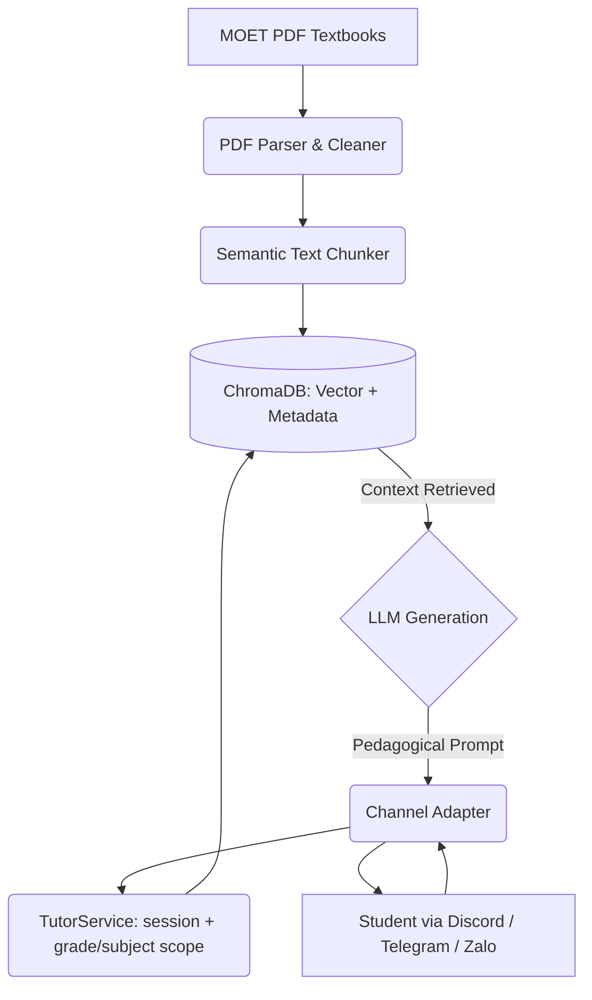

# 🎒 DoraEdu: The Magic Textbook Pouch (Zero-Hallucination RAG Bot)

**DoraEdu** is an offline-first, highly strictly controlled Retrieval-Augmented Generation (RAG) chatbot designed exclusively for Vietnamese students.

It acts as a 24/7 intelligent tutor that relies **100% on official textbooks** from the Ministry of Education and Training (MOET). It ships as a Discord bot today and is built channel-agnostic, so Telegram and Zalo are adapters rather than rewrites.

## 🌟 The "Zero-Hallucination" Promise

Unlike standard ChatGPT or generic AI assistants that might hallucinate answers or pull information from unregulated internet sources, DoraEdu is built with **strict pedagogical guardrails**:

1. **Metadata Isolation:** A 6th-grade student asking about Math will only receive answers from Math textbooks of grade 6 or below (never grade 7+) — the grade filter is a ceiling, not an exact match, so reviewing earlier material is allowed but reaching ahead is not. `Retriever.retrieve()` only accepts a `StudentProfile`, whose `grade` and `subject` are both mandatory — so no query can reach ChromaDB unfiltered.
2. **Context-bound Generation:** The system prompt forces the LLM to reply with *"Mình chưa tìm thấy thông tin này trong sách giáo khoa của bạn"* if the answer cannot be found in the retrieved documents. When retrieval returns nothing, that answer is returned **without calling the LLM at all**.
3. **Socratic Tutoring:** The bot guides students toward the answer with hints and questions instead of handing over the finished solution, preventing rote copying.

## 🏗️ System Architecture

DoraEdu operates on a modern Data Pipeline and Generation flow:



See `dora_edu_architecture.md` for the full module map and layering rules.

## 🚀 Quick Start (Development)

This project uses modern Python packaging via `pyproject.toml` (PEP 621).

### 1. Prerequisites

* Python >= 3.12
* [Tesseract OCR](https://github.com/tesseract-ocr/tesseract) with the Vietnamese language pack — most real MOET textbook PDFs are scans with no text layer, so `dora-ingest`/`dora-bulk-ingest` OCR them locally. On macOS: `brew install tesseract tesseract-lang`. On Debian/Ubuntu: `apt install tesseract-ocr tesseract-ocr-vie`.
* A Discord Bot Token (from the [Discord Developer Portal](https://discord.com/developers/applications)) — the primary channel today; a Telegram Bot Token (from BotFather) and/or a Zalo Official Account access token + secret key also work, since the bot layer is channel-agnostic
* A Gemini API key (`LLM_PROVIDER=gemini`, get one free at [aistudio.google.com/apikey](https://aistudio.google.com/apikey)) — or an OpenAI API key / any OpenAI-compatible endpoint via `OPENAI_BASE_URL`, including a local model

### 2. Installation

Clone the repository and install the project along with its dependencies using editable mode:

```bash
git clone https://github.com/quannguyencoder/dora_edu.git
cd dora_edu

# Create a virtual environment
python3 -m venv .venv
source .venv/bin/activate  # On Windows use `.venv\Scripts\activate`

# Install the project and dependencies via pyproject.toml
pip install -e ".[dev]"
```

The first run downloads the local embedding model (`sentence-transformers`), after which retrieval works offline.

### 3. Environment Variables

Copy `.env.example` to `.env` and fill it in:

```bash
cp .env.example .env
```

Only `TELEGRAM_BOT_TOKEN` and `OPENAI_API_KEY` are required; every other value has a working default.

## 🛠️ Usage

Entry points are defined in `pyproject.toml`.

**1. Data Ingestion (Admin Only):**
Process the textbook PDFs and build the ChromaDB index. `--path` accepts a single PDF or a directory searched recursively.

```bash
dora-ingest --path ./data/raw_pdfs --subject "Lich su" --grade 12
```

Useful flags:

| Flag | Meaning |
|---|---|
| `--grade` | Grade level 1-12, stored as filter metadata (required) |
| `--subject` | Subject name; aliases are normalised, so `toan`, `Toán` and `TOAN` all store `Toán` (required) |
| `--book-title` | Title cited back to the student; defaults to the PDF file name |
| `--dry-run` | Parse and chunk without writing to ChromaDB |

Re-running ingestion on the same PDF upserts rather than duplicating, so it is safe to repeat.

**2. Bulk Data Ingestion (Admin Only):**
Index every PDF already collected under `data/raw_pdfs/<grade>/`, inferring each book's grade, subject and title from its filename (the real MOET naming convention, e.g. `SGKToan9tapmot.pdf`).

```bash
dora-bulk-ingest --dry-run   # preview grade/subject/title inference for every file first
dora-bulk-ingest             # then actually parse, OCR, chunk and index them all
```

A file whose name cannot be parsed, or whose filename-encoded grade disagrees with its folder, is skipped and reported rather than guessed at.

**3. Start the Bot:**

```bash
dora-run-discord-bot   # Discord, gateway connection (no public URL needed)
dora-run-bot            # Telegram, long polling
dora-run-zalo-bot       # Zalo OA, webhook server (put a reverse proxy + TLS in front, and register the public URL with your OA)
```

### Student commands

| Command | Purpose |
|---|---|
| `/start` | Welcome message and onboarding |
| `/lop <1-12>` | Set the student's grade (required) |
| `/mon <tên môn>` | Pin the subject, e.g. `/mon Toán` (optional — the subject is auto-detected per question otherwise) |
| `/toi` | Show the current grade and subject |
| `/xoa` | Clear the conversation history |
| `/trogiup` | Show help |

The bot refuses to search the textbooks until a grade is set. The subject is auto-detected from each question unless pinned with `/mon`; the grade filter is a ceiling, not an exact match, so a student can also be shown content from any grade at or below their own (e.g. reviewing earlier material) but never from a grade above it.

## 🧪 Tests

```bash
pytest
```

The suite covers the guardrails directly: grade/subject isolation, the anti-hallucination short circuit, the Socratic prompt contract, filename-to-metadata inference for the real textbook corpus, the real Discord and Zalo adapters, and a throwaway fake channel proving that adding a new channel requires no changes to the RAG or LLM layers.

## 🤝 Contributing

Contributions are welcome! Please read `.github/copilot-instructions.md` and `claude.md` to understand our coding standards.
