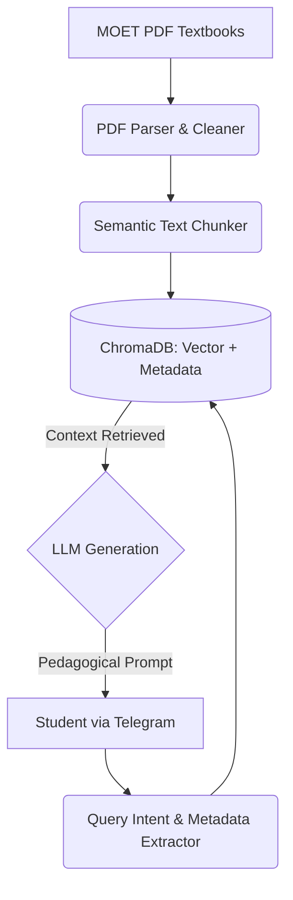

# 🎒 DoraEdu: The Magic Textbook Pouch (Zero-Hallucination RAG Bot)

**DoraEdu** is an offline-first, highly strictly controlled Retrieval-Augmented Generation (RAG) Telegram Bot designed exclusively for Vietnamese students.

It acts as a 24/7 intelligent tutor that relies **100% on official textbooks** from the Ministry of Education and Training (MOET).

## 🌟 The "Zero-Hallucination" Promise

Unlike standard ChatGPT or generic AI assistants that might hallucinate answers or pull information from unregulated internet sources, DoraEdu is built with **strict pedagogical guardrails**:

1. **Metadata Isolation:** A 6th-grade student asking about Math will ONLY receive answers from 6th-grade textbooks. The vector database filters context rigorously before sending it to the LLM.
2. **Context-bound Generation:** The system prompt forces the LLM to reply with *"This information is not in your textbook"* if the answer cannot be found in the retrieved documents.
3. **Socratic Tutoring:** The bot is designed to guide students toward the answer rather than just giving them the final solution, preventing rote copying.

## 🏗️ System Architecture

DoraEdu operates on a modern Data Pipeline and Generation flow:



## 🚀 Quick Start (Development)

This project uses modern Python packaging via `pyproject.toml` (PEP 621).

### 1. Prerequisites

* Python >= 3.14
* A Telegram Bot Token (from BotFather)
* OpenAI API Key (or local LLM setup)

### 2. Installation

Clone the repository and install the project along with its dependencies using editable mode:

```bash
git clone https://github.com/npak243/dora-edu.git
cd dora-edu

# Create a virtual environment
python -m venv venv
source venv/bin/activate  # On Windows use `venv\Scripts\activate`

# Install the project and dependencies via pyproject.toml
pip install -e .
```

### 3. Environment Variables

Create a `.env` file in the root directory:

```env
TELEGRAM_BOT_TOKEN="your_token_here"
OPENAI_API_KEY="your_api_key"
CHROMA_DB_PATH="./vector_db"
```

## 🛠️ Usage

Since we define entry points in `pyproject.toml`, you can run the system using the provided CLI commands.

**1. Data Ingestion (Admin Only):**
Process the textbook PDFs and build the ChromaDB index.
```bash
dora-ingest --path ./data/raw_pdfs --subject History --grade 12
```

**2. Start the Bot:**
Launch the Telegram polling loop.
```bash
dora-run-bot
```

## 🤝 Contributing

Contributions are welcome! Please ensure you read `.github/copilot-instructions.md` to understand our coding standards.
